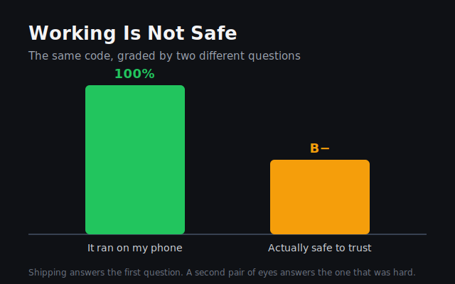

I shipped a fix this week. A screen in my app had been showing the wrong thing, I tracked down why, built the repair, pushed it, and watched the right numbers finally appear on my phone. It worked. I felt done.

That feeling — *it works, I'm done* — turns out to be the exact place the real lesson was hiding.

Instead of moving on, I did something I would not have had the nerve to do six months ago. I pointed a small army of AI reviewers at my own code and told them to be ruthless. Not one or two. Hundreds of them, in waves, overnight, each reading the same code from a different angle while I went to bed.

I woke up to a B minus.

Not because the code was broken — it ran fine. The grade was lower because *running* was never the bar I should have been measuring against. The reviewers kept finding the same shape of problem: code that trusted something just because of where it came from. A value arrives from a place that looks trustworthy, so the code waves it through without ever checking that it is actually what it claims to be. Nothing breaks on my phone, with my data, today. But "nothing breaks for me right now" is a much smaller promise than "this is safe," and I had been quietly treating them as the same promise.

That is the rung I climbed this week: **working and safe are two different questions, and shipping only answers the first one.**

## You cannot be the one who finds your own blind spots

Here is the part that actually rearranged something in my head.

When I had one reviewer go over the code, it kept missing things. Not because it was lazy — because it was reading the code through the same assumptions that wrote it. It trusted the trustworthy-looking value for the same reason I did. Its blind spot and my blind spot were the same blind spot.

What surfaced the real problems was a *different* reviewer. A different model, with no loyalty to the first one's logic, looking at the identical code and refusing to grant the assumption a free pass. It caught what the first one — and I — could not see, precisely because it did not share the frame.

I have written before about not being able to grade my own understanding. This is the same lesson wearing work boots. You cannot audit your own code with only your own eyes, because the eyes that wrote the bug are carrying the belief that made it. The fix is not *try harder* or *look again*. The fix is *a second pair of eyes that doesn't share your assumptions.*

So now "it runs" is where I start, not where I stop. I ship it, then I hand it to something that owes my assumptions nothing and ask the only question that was ever hard: not does it work — is it safe.
