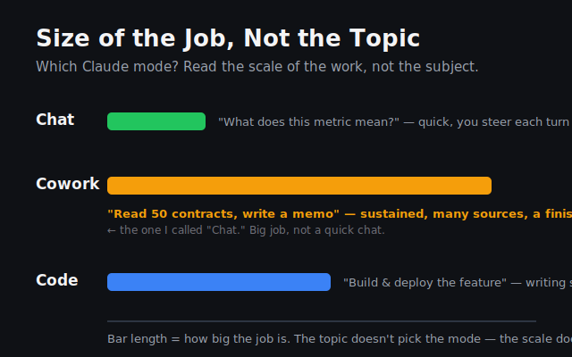
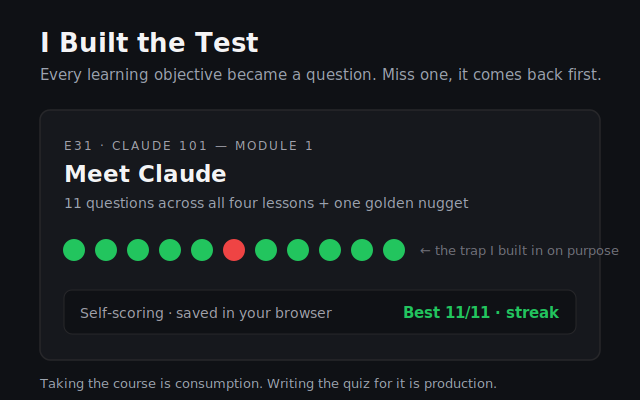

I scrapped the plan again. Months into a data-analytics cert, I closed the book and started Anthropic's own Claude 101 course from zero — the most basic "what is this thing" lesson, sitting in the terminal I use to run three different pipelines every day.

The whole first module took an afternoon. What Claude is, how to talk to it, the three desktop modes. I locked each lesson by saying it back in my own words instead of nodding along to a video. Most of it landed clean. One thing didn't: I was asked which mode handles "read fifty contracts and write me a memo," and I said Chat. Wrong. That's Cowork — sustained work across many sources that ends in a finished thing. The signal isn't the topic, it's the size of the job. You don't send one inspector to rebuild a whole yard, and you don't call out the full work-crew to tighten a single bolt. I'd read the subject and missed the scale.

Then I did the part that actually teaches: I built the test. Every learning objective from the module became a question in a live quiz on my site — self-scoring, and the ones you miss come back first. Eleven questions, the trap I fell into included on purpose. Taking a course is consumption. Writing the quiz for it is production, and production is where the knowing happens.

Somewhere in there I caught myself reaching for bonus points — extra coverage, polishing lesson one while thirteen more waited. I'm a perfectionist and it shows up as stalling dressed as diligence. So I made a rule: the lesson's stated objectives are the bar. Hit them in my own words, capture the rest for reference, move. Across a course, momentum compounds harder than polish ever will. Gold-plating the first lesson is just an expensive way to never reach the last one.

One module a day. The objectives are the test, the test ships to the site, the site keeps score. Tomorrow it's Projects, Artifacts, and Skills — and I already know what "done" looks like.
