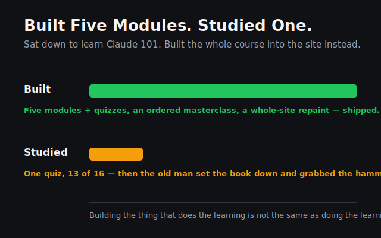

Gather round. The old man's got a confession, and it ain't a proud one.

I sat down at this desk to do my schooling — Claude 101, module two, the one I keep meaning to finish. Honest intentions. Then the tiredness rolled in like fog through the pines, and a tired man in the woods does what a tired man always does: he finds something easier to swing the axe at.

So I built a school.

Not a metaphor. I took the whole course — all five modules — and carved them into my own website. Quizzes and all. Then I stood back, decided the place was ugly, and repainted every wall: turned one whole wing black-on-white, flipped the other to match, hung a proper signpost so a body can tell where he's standing. Worked till the lamp burned low. Felt grand.

And the studying? One quiz. Thirteen out of sixteen. Then I set the book down and picked the hammer back up — like a fool who builds himself a fine warm woodshed and never once steps inside it.

Here's the splinter, and it sits deep: building the thing that *does* the learning is not the same as doing the learning. The first is loud and quick and hands you something to hold up in the firelight. The second is slow and quiet and a little humbling. A tired brain picks the loud one every single time.

But the school's built now. No more lumber to cut. No excuse left leaning by the door.

Tomorrow the old man goes to class.
