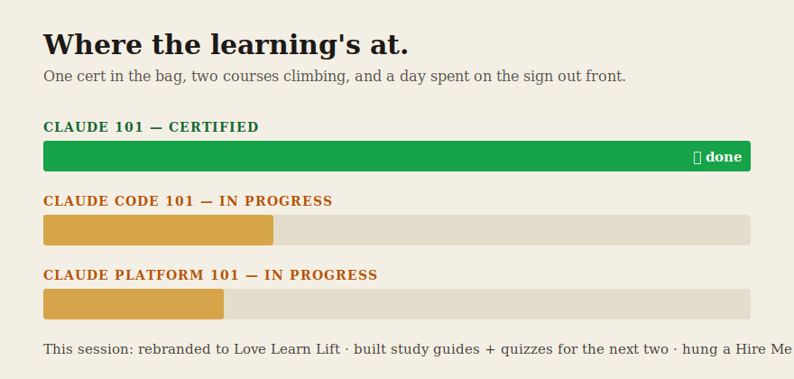

I finished Claude 101. Certificate and all — Anthropic Academy, signed and dated. First one's in the bag, and I'm already climbing the next two: Claude Code 101 and the Claude developer platform.

So today wasn't the coursework. Today was everything *around* the coursework — the part nobody frames on the wall.

I rebranded the whole project to Love Learn Lift: new name, new README, renamed the repo, top to bottom. I took the two courses I'm working through next and built each one into a study guide on the site — every lesson a page, every page a self-scoring quiz. I captured both full courses first, so those guides are grounded in the actual material instead of my paraphrase of it. And I hung a Hire Me page — the first time I've put out an honest "here's what I can build for you."

None of that is the flashy part, and that's the point. The name over the door, the quiz engine, the signpost — that's the infrastructure a public build actually runs on. It's the difference between studying something once and building the place where it sticks, out loud, where anyone can check my work.

Take the study guides. It would've been faster to just watch the videos and move on. But watching isn't knowing — a week later it's gone. So each course now has the loop that actually holds: read the idea, try to say it back, prove it on a quiz that remembers what I missed and feeds it back to me. Build that once, and every course after this drops into the same machine.

The Hire Me page is the other half. I've spent months shipping in public — pipelines, agents, this whole site — and never once said out loud that I'd build the same for someone else. Now it's there in plain type: agentic systems, automations, the tool you actually need, idea to shipped. Putting it on the wall is its own kind of commitment.

Cert one is framed. The site's got its real name. The shingle's out front. Next session I'm back inside the next course — but the scaffolding it lands on is a lot sturdier than it was this morning.
