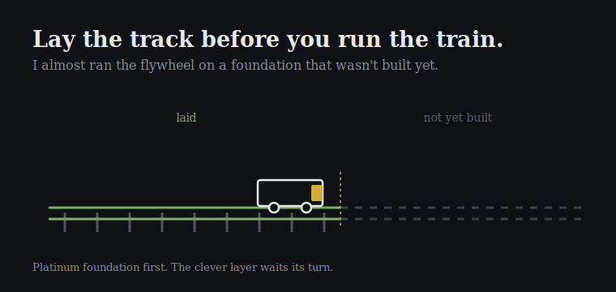

My build assistant forgot everything between sessions. Every morning it woke up blank, did the work, was useful, and was gone by night. So the first thing I built today was a memory: a file it reads the moment it wakes, and one it writes before it sleeps. Now it remembers what it made and what it got wrong.

That part went well. Most of the day was me saying no. I tried to give it a voice three times and killed all three — a voice that grated, a player I made it tear out, a panel I had it rip off the screen. Building isn't the part where everything works. It's the part where you find the shape by hitting walls until one of them holds.

Then came the real decision, and it was about restraint. I'd sketched a whole arc of clever automation to sit on top of this thing: the assistant drafting posts in my voice, scheduled calls to capture the day, the works. Exciting. And wrong, in the order I had it. The core loop underneath — the part that actually records and stores a single day — isn't finished yet. I was about to pour a flywheel onto wet concrete.

## Lay the Track Before You Run the Train

You don't run a train on track you haven't finished laying. Doesn't matter how good the locomotive is. So I threw out the shiny roadmap and locked a boring one: build the backend all the way, for one user, until it holds — then the clever layer. "We need a platinum foundation to build off," is how I said it, and writing it down made me feel the cost of every project where I skipped that rule and paid for it later.

The trap isn't laziness. It's momentum. The fancy layer is more fun to build than the plumbing, so you build it first and spend the next year patching a thing that should have been finished once. A foundation is slow to admire and the only reason anything you stack on it stays standing.

Next session lays the first sleeper.
