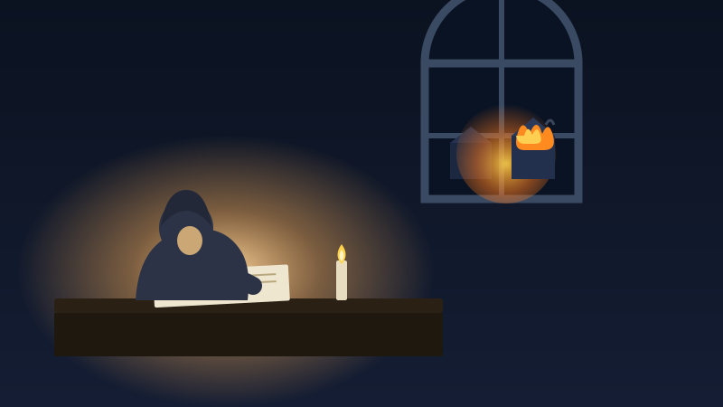

For months I believed my journal was safe. There were scripts. There was a folder named "backup." There was a reassuring little routine that, in my head, meant I'd done the responsible thing.

Then I actually looked. The remote those scripts pushed to didn't exist. The scheduled job had never once run. And the single thing that code could do, if it ever worked, was copy twenty-four years of private writing to the internet in plain text. I hadn't built a safety net. I'd built a painting of one and hung it on the wall.

It's the oldest mistake there is. The Library of Alexandria held the greatest collection of knowledge in the ancient world — one building, one copy, no plan B. When it burned, the loss was absolute. The writing that survived antiquity didn't make it because anyone felt confident. It survived because monks spent centuries copying texts by hand and scattering those copies across far-apart monasteries. Tedious, redundant, off-site. That stubborn habit is the only reason we can still read the ancients at all.

So I ripped the fake backup out and built a real one: every entry encrypted, copied off the machine, automatically, every week. Then I made myself do the step everyone skips — I opened one of those backups and checked that it actually came back.

That step is the whole game. A backup you've never restored isn't a backup; it's a hope with a filename. "I set up a system" and "I am protected" are two different sentences, and the quiet gap between them is exactly where people lose the things they can never get back.

Don't trust the folder. Trust the restore.
