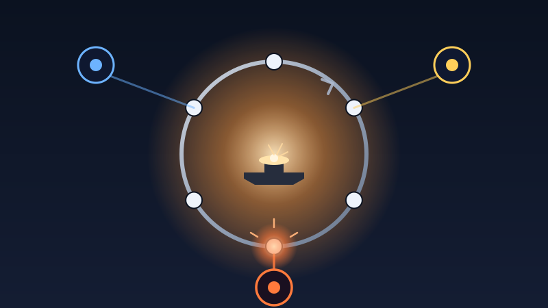

A build pipeline is a cycle. Mine runs the same six stations on every task: scope the work, plan it, review the plan, ship the code, close the loop, then back to the top for the next one. One task at a time, around and around. It's how a solo builder keeps a 24-month build from sliding into chaos. The cycle never skips a step, so nothing important gets quietly dropped.

This session I changed what runs *inside* that cycle.

The old shape was one mind. The AI moved each task through every station. It planned the work, then reviewed its own plan. It shipped the code, then reviewed its own code. The flaw is obvious once you say it out loud: an author can't audit their own work. They carry the same blind spots into the review that they had during the build.

So I built the forgeline, a panel of three independent models riding every station. One is the foreman, holding the plan and making the calls. The other two come from different model families, with different blind spots, and their job is to disagree. The point was never more hands. It was divergence: a second and third set of eyes that can actually tell the foreman he's wrong.

## A Rule You Only Describe Isn't Enforced

Then I did the honest thing and pointed the new panel at its own wiring.

The two reasoning models read my work and called it fine. The third, the one that actually runs the codebase, did not. It found that I'd written the review step into every station as clean prose but never wired it into the checklist that stops a station from finishing. Described, not enforced. The panel looked complete and would have done nothing.

I've shipped that exact mistake before. A thing that looks right isn't a thing that works, and three "looks good" votes would have proven it again. The one divergent voice didn't.

I fixed it before committing. Tomorrow the crew points at real product code for the first time, instead of auditing itself.
